# ZYNQ7010/7020_AD9363/AD9364/AD9361
<<<<<<< HEAD

####  Open source SDR hardware based on ZYNQ+AD936X
=======
>>>>>>> ac6507f2fe1946b64a4697f9ff1226f25c21065f

[中文](./README_CN.md) 
##  Open source SDR hardware based on ZYNQ+AD936X

<<<<<<< HEAD
## The preliminary development work has been completed and the product has entered the trial production stage. Please contact the email address: 1399109998@qq.com for finished products.

new version 2021.3.22 add pa、lna、32bit ddr3 1gb

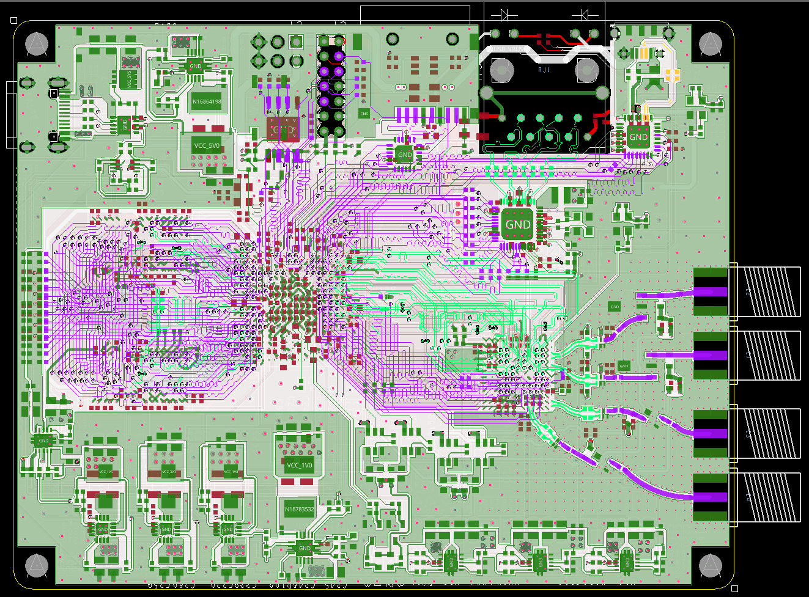

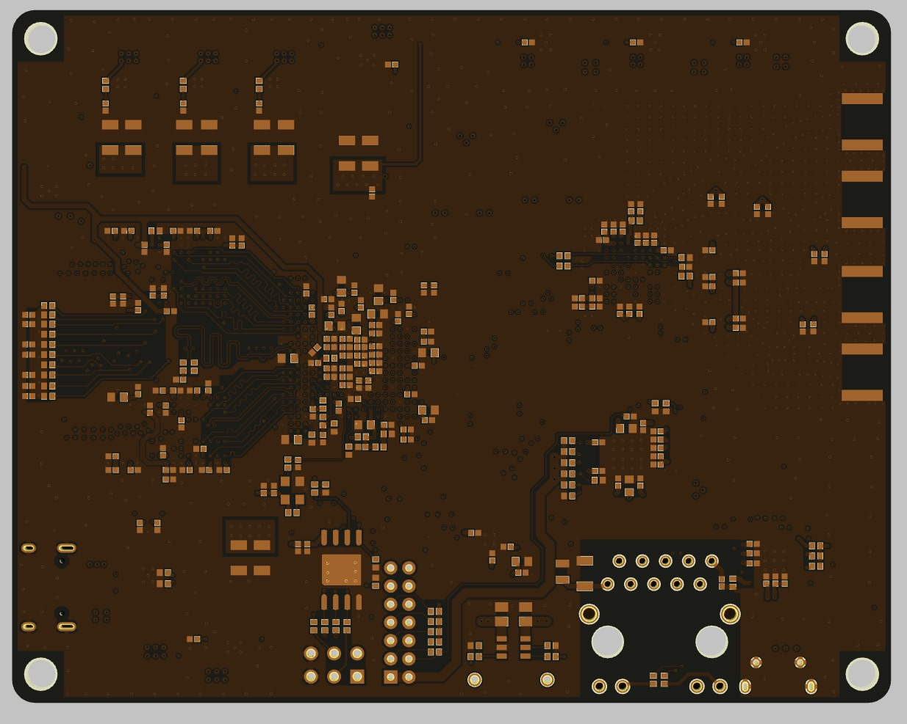
=======
## The preliminary development work has been completed and the product has entered the trial production stage. Please contact the email address: 1399109998@qq.com for the finished products.
>>>>>>> d6aa36bef5f305c4cdff866e0592ac313a4012c5

Project introduction video:

- https://www.youtube.com/watch?v=Qk-M8yRsKvs 

- https://www.youtube.com/watch?v=xx4MXQSHmCM&t=153s

GSM signals receiver test:
- https://www.youtube.com/watch?v=yFEpSrWW0-w

FM signal receiver test:
- https://www.youtube.com/watch?v=ASb7dLIEmfY

Sine wave signal transmission test:
- https://www.youtube.com/watch?v=bfs_GfULIoA&t=55s

Loopback signal test:
- https://www.youtube.com/watch?v=JOjsKboq0xA

The pluto-sdr firmware transplantation work is all done, flashing the firmware without hacking the system, the default is AD9364.

Regarding to the BOM cost, ZYNQ7010/ZYN17020 and AD9363 cost about 150-200 RMB with the disassembled chip. The use of brand-new chips does not have bargaining power due to the small number of BOM costs around 1,000 RMB.

#### 1. Hardware solution

FPGA: ZYNQ7010/7020 (ZYNQ7010 and ZYNQ7020 can be replaced with each other, if you need more hardware resources, please use ZYNQ7020)

RF: AD9361/AD9363/AD9364 (the three chips can be replaced with each other, the difference lies in the bandwidth. Among them, AD9361 has better performance, try to use the ABCZ ending chip, which is different from BBCZ)

https://ez.analog.com/wide-band-rf-transceivers/design-support/f/q-a/80027/what-is-difference-of-ad9363-abcz-and-bbcz?ReplyOffsetId=179002&ReplyOffsetDirection=Next&ReplySortBy=CreatedDate&ReplySortOrder=Ascending&pifragment-7309=2

AD9363ABCZ Band: 325 MHz to 3.8 GHz

AD9363BBCZ Band: 650 MHz to 2.7 GHz

RAM Memory: DDR3 256M16

USB-PHY: USB3320C

GMAC-PHY: RTL8211E-VL (RTL8211E has two endings, VB and VL, where VB level is 3.3V/2.5V, VL is 1.8V)

QSPI FLASH: W25Q256 32MB

Power supply topology diagram

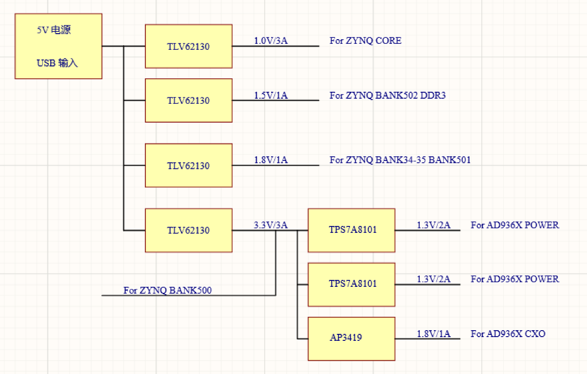

block design

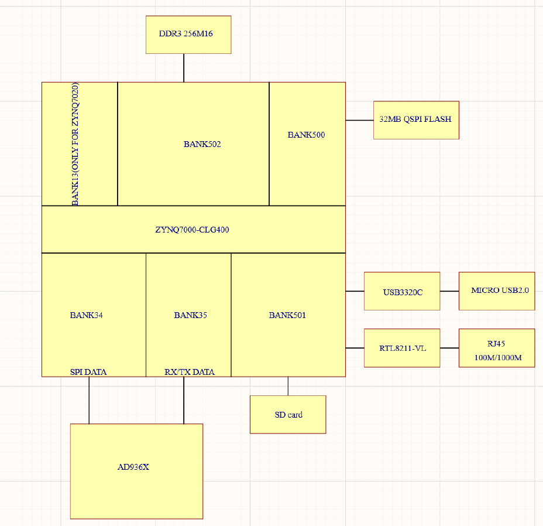

##### 2. Software resources

Support Pluto-SDR firmware transplantation, OpenWiFi (ZYNQ7020 FPGA required), support adi official ZED+AD-FMCOMMS2/3/4 related firmware code

#### 3. PCB board design

Design software:  Altium Designer Kicad

Number of layers: 4 layers （signal layer[1]、GND[2]、POWER[3]、signal layer[4]）

Craft: JLC PCB Craft

Impedance: not supported

The impedance version will be tested in March 2021, and the openwifi port is currently undergoing normal transceiver tests.

#### 4. Differences compared to ADALM-PLUTO:

- Support for Zynq-7020 and Zynq-7010 in 400pin BGA package
- Support 2R2T transceiver mode
- 4 layer board to reduce cost
- SD slot for running real Linux distros
- Support Gigabit Ethernet

#### 5. Project display:

This is the PCB rendering

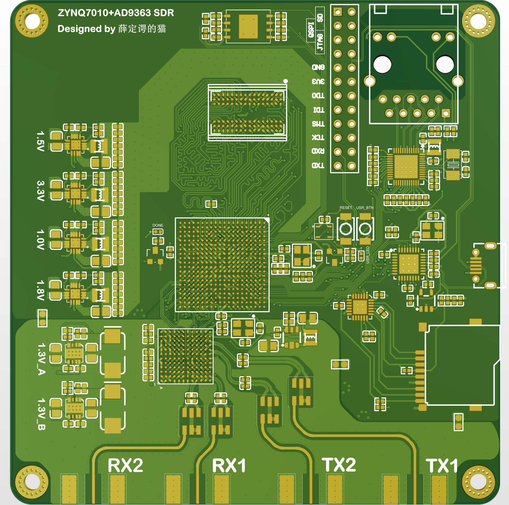

This is the physical picture of the PCB

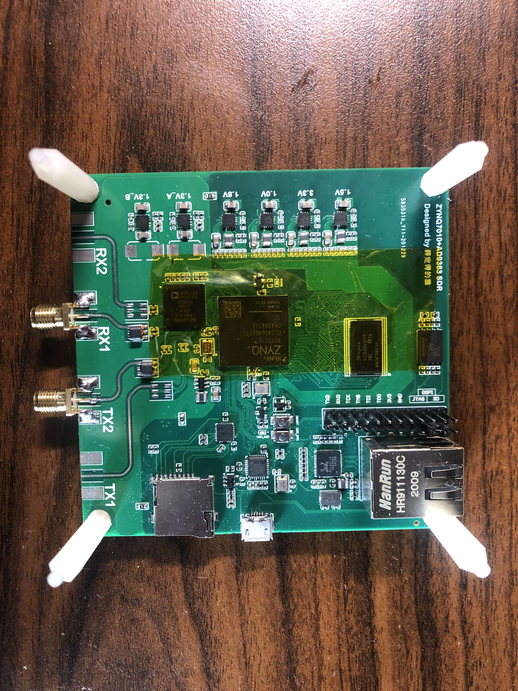

This is the details of the PCB RF part

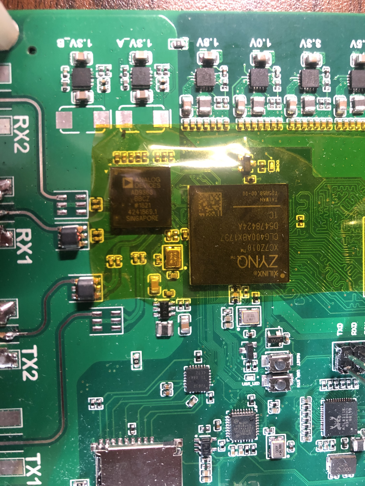

Ethernet can work stably at 1000M (using single-arm routing for testing in the figure)

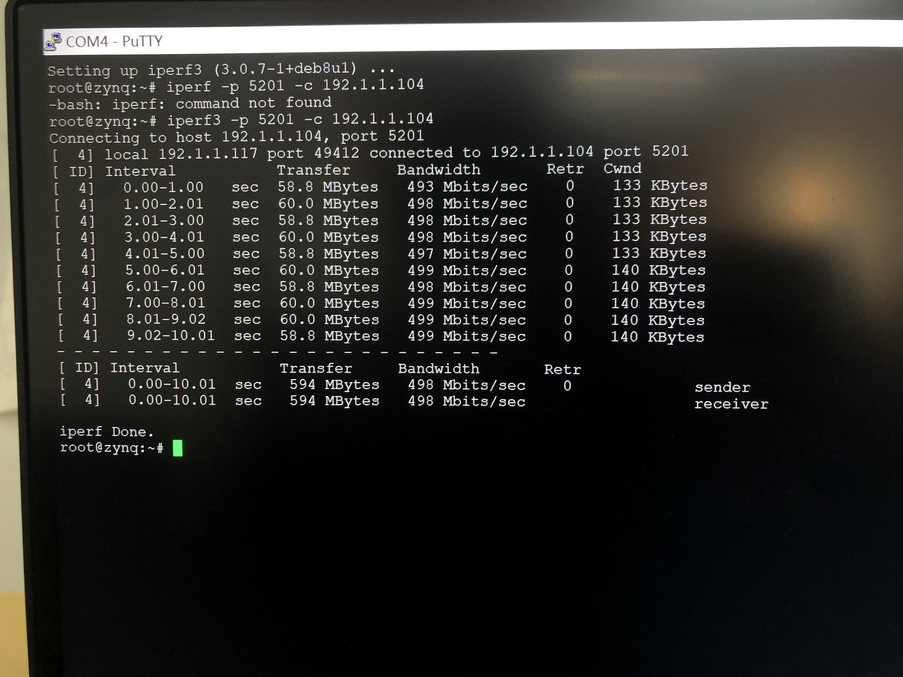

AD9363 initializes the normal graph using adi no-os test environment

Pluto-uboot transplanted successfully

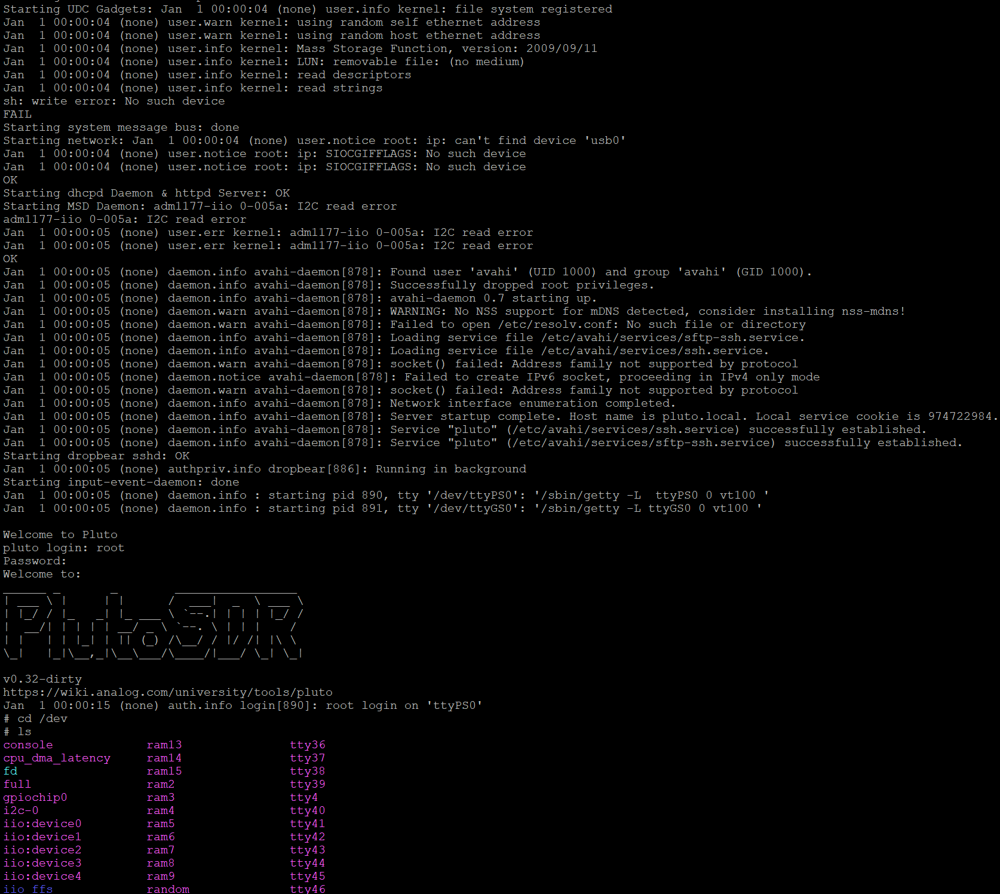

Pluto firmware works fine

Receive GSM signal normally

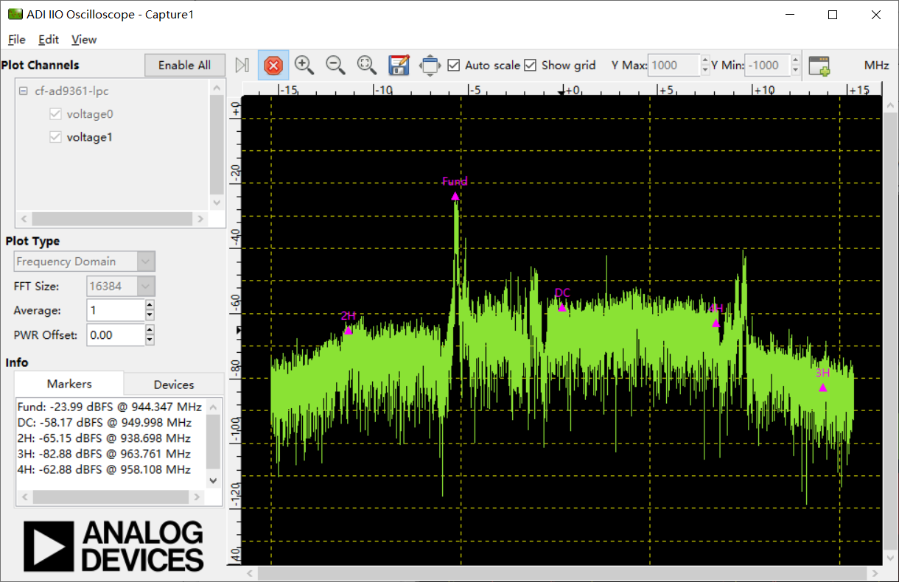

Hack into AD9364 to receive FM signal

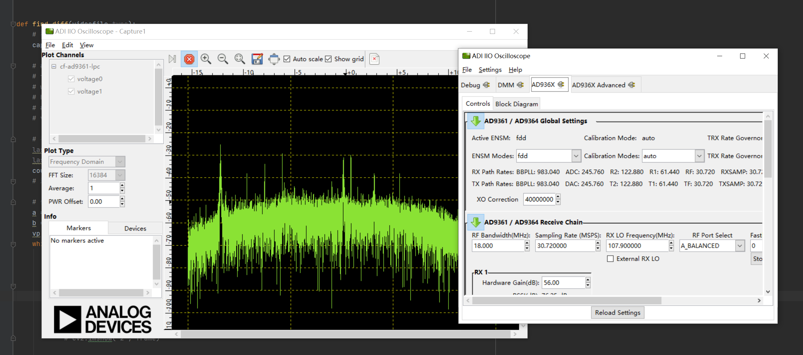

Two PCBAs receive and send each other test

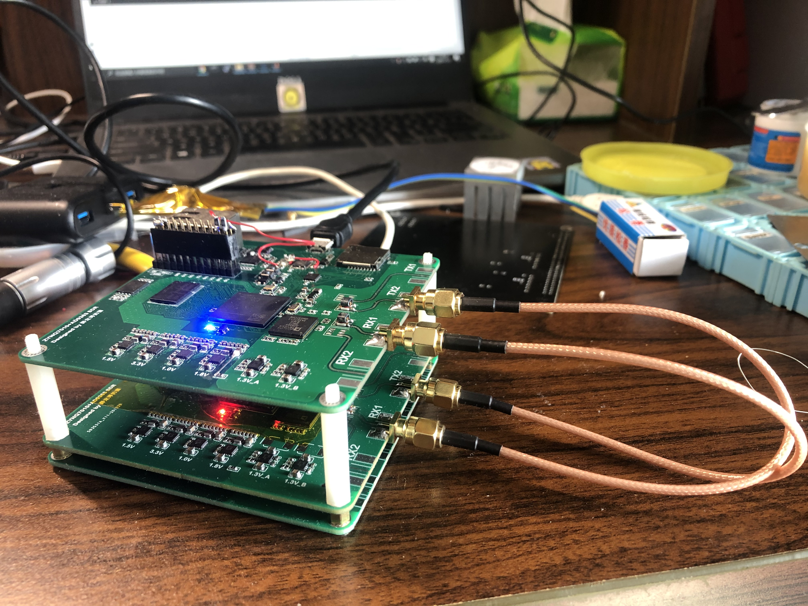

PCBAs can be stacked on each other and connected through Gigabit switches and routers

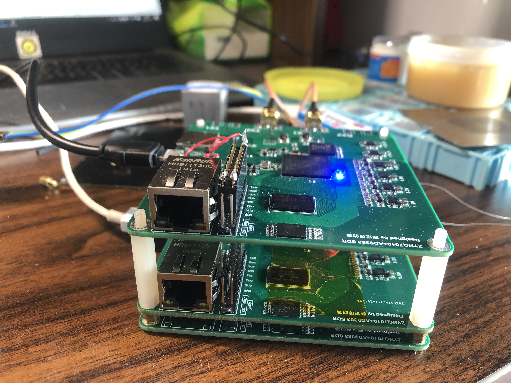

Support SDR-SHARP

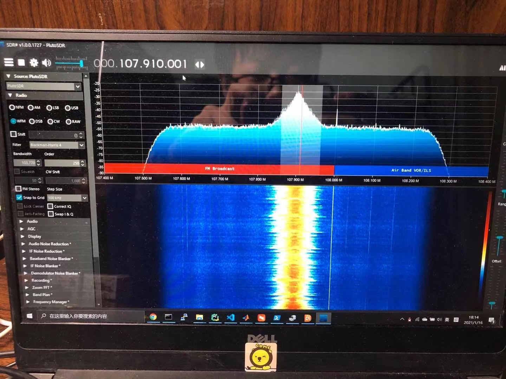

##### 6.TO DO LIST

- Continue to optimize the RF part to reach the adi official demo board indicators
- Impedance design based on four-layer pcb
- To be completed in January-February of 2021, to complete the relevant transplantation work of openwifi
- Design the impedance version in March 2021
- Conduct commercial index tests on the impedance version in April 2021
- When the commercial version is launched at the end of April 2021, it will support adi's official SDR firmware (ADRV9364 packet), openwifi, and openbts openbts, etc.

